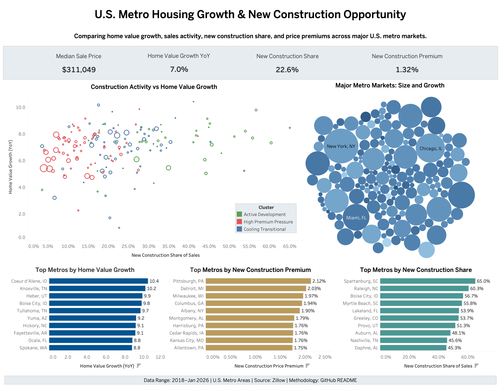

# U.S. Metro Housing Growth & New Construction Opportunity

## Project Overview

This project analyzes U.S. metro housing markets using Zillow data from 2018 to January 2026. The dashboard compares home value growth, median sale prices, sales activity, new construction share, and new construction price premiums across major U.S. metro areas.

The goal is to identify where housing growth is strongest, where new construction is most active, and which metro markets may show signs of opportunity, pressure, or transition.

## Live Dashboard

[View the interactive Tableau dashboard](https://public.tableau.com/app/profile/rezvan.heydari/viz/convsvalue/U_S_MetroHousingGrowthNewConstructionOpportunity)

## Dashboard Preview

## Business Question

Which U.S. metro markets show the strongest combination of home value growth, construction activity, sales activity, and new construction pricing power?

## Supporting Questions

- Which metros have the strongest recent home value growth?
- Which metros show the highest new construction share of total sales?
- Where are new construction homes priced at a premium relative to the broader market?
- Which large metro markets combine strong sales activity with home value growth?
- Can metros be grouped into meaningful market types based on demand and construction behavior?

## Data Source

Source: Zillow  
Data range: 2018–January 2026  
Geography: U.S. metro areas

## Data Used

- Metro ZHVI All Homes
- Metro Median Sale Price
- Metro Sales Count
- Metro New Construction Sales Count
- Metro New Construction Median Sale Price

## Key Metrics

- Median Sale Price
- Home Value Growth YoY
- Median Sale Price YoY Growth
- Sales Count YoY Growth
- New Construction Share of Sales
- New Construction Sales YoY Growth
- New Construction Price Premium

## Methods

- Data cleaning and reshaping
- Monthly metro-level data preparation
- Year-over-year growth analysis
- Feature engineering
- K-means clustering
- Tableau dashboard design

## Cluster Groups

The metro areas were segmented into three market groups:

- **Active Development Markets**: metros with stronger new construction activity and continued home value growth
- **High Premium Pressure Markets**: metros where new construction homes are priced at a higher premium relative to the broader market
- **Cooling Transitional Markets**: metros showing more moderate or transitional housing and construction signals

## Dashboard Features

- KPI cards summarizing median sale price, home value growth, new construction share, and new construction premium
- Scatter plot comparing construction activity and home value growth
- Bubble chart showing metro market size and home value growth
- Top metro rankings by home value growth
- Top metro rankings by new construction share
- Top metro rankings by new construction premium

## Project Outputs

- `metro_core_final.csv` — monthly metro-level dataset for Tableau trend analysis
- `metro_summary_final.csv` — summary dataset for dashboard views, rankings, clustering, and KPI metrics
- `metro_housing_analysis.ipynb` — project notebook for data cleaning, feature engineering, and clustering
- `dashboard_preview.png` — dashboard preview image
- Tableau Public dashboard

## Tools Used

- Python
- Pandas
- Scikit-learn
- Tableau Public
- GitHub

## Limitations

This project is intended for market analysis and portfolio demonstration. The dashboard does not provide financial, investment, lending, or underwriting advice. Market opportunity should be evaluated with additional local, economic, demographic, and property-level research.
